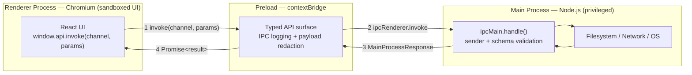
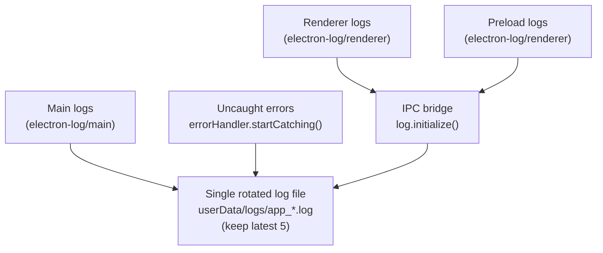

# Windows Electron Starter Kit

An enterprise-grade, production-ready Electron starter kit for Windows desktop applications. It ships with a typed, runtime-validated IPC layer, a sandboxed renderer, structured and rotated logging with sensitive-data redaction, and a modern React + TypeScript UI — batteries included, with sensible defaults that hold up in production.

## Stack

| Layer | Technology |
|---|---|
| Framework | [Electron](https://www.electronjs.org/) + [electron-vite](https://electron-vite.org/) |
| UI | [React 19](https://react.dev/) + [TypeScript](https://www.typescriptlang.org/) |
| Styling | [Tailwind CSS v4](https://tailwindcss.com/) + [shadcn/ui](https://ui.shadcn.com/) |
| Notifications | [Sonner](https://sonner.emilkowal.ski/) |
| Validation | [Zod](https://zod.dev/) |
| Persistence | [electron-store](https://github.com/sindresorhus/electron-store) |
| Logging | [electron-log](https://github.com/megahertz/electron-log) |
| Auto-update | [electron-updater](https://www.electron.build/auto-update) (dependency available; not yet wired) |
| Packaging | [electron-builder](https://www.electron.build/) |

## Getting Started

```bash
# Clone
git clone https://github.com/sandeep-menon/windows-electron-starter-kit.git
cd windows-electron-starter-kit

# Install
npm install

# Develop
npm run dev

# Build for Windows
npm run build:win
```

## Available Scripts

| Script | Description |
|---|---|
| `npm run dev` | Start in development mode. Renderer has full HMR (state-preserving). |
| `npm run dev:watch` | Same as `dev`, but also watches the **main** and **preload** processes and automatically rebuilds + restarts the app when they change. |
| `npm run start` | Preview a production build locally (`electron-vite preview`). |
| `npm run build` | Type-check, then build all processes for distribution. |
| `npm run build:win` | Build and package a Windows installer. |
| `npm run build:mac` / `build:linux` | Build and package for macOS / Linux. |
| `npm run build:unpack` | Build an unpacked directory (useful for inspection/debugging). |
| `npm run typecheck` | Type-check both the Node (main/preload) and web (renderer) projects. |
| `npm run lint` | Run ESLint across the project. |
| `npm run format` | Format the codebase with Prettier. |

> **Note on hot reload:** `npm run dev` only hot-reloads the **renderer** (React UI). The main and preload processes are Node code and cannot be hot-swapped in place — use `npm run dev:watch` to have electron-vite rebuild and **restart** the app automatically when you edit them.

## Project Structure

```
src/
├── main/                     # Electron main process (Node.js)
│   ├── index.ts              # App lifecycle, window creation, bootstrap
│   ├── handler.ts            # IPC handlers + sender & schema validation
│   └── utils/
│       └── application.ts    # Logging setup, rotation, environment diagnostics
├── preload/                  # Secure bridge between main and renderer
│   ├── index.ts              # contextBridge API + IPC logging + payload redaction
│   └── index.d.ts            # Typed `window.api` declarations
├── renderer/                 # React application (UI)
│   └── src/
│       ├── App.tsx
│       ├── main.tsx
│       └── components/ui/     # shadcn/ui components
└── shared/                   # Code shared across all three processes
    ├── protocol.ts           # IPC contract: Zod schemas + inferred types (single source of truth)
    └── types.ts              # Shared types (e.g. MainProcessResponse)
```

## Architecture

Electron runs your code in three isolated contexts that cannot call each other directly. This kit treats the boundary between them as a first-class, **fully typed and runtime-validated** contract.



- **Renderer** has no Node.js or OS access by design. It can only send the specific messages the preload exposes.
- **Preload** is the single, controlled doorway. It uses `contextBridge.exposeInMainWorld` to publish a minimal `window.api` and nothing else.
- **Main** performs all privileged work (network, filesystem, OS) inside handlers registered in `src/main/handler.ts` — but only after validating the sender and the payload.

### Typed IPC contract

Every IPC channel is declared **once**, in `src/shared/protocol.ts`, as a [Zod](https://zod.dev/) schema. That single declaration is the source of truth for *both* the compile-time types and the runtime validation:

```ts
// src/shared/protocol.ts — the single source of truth
export const IPCParamSchemas = {
  "get-random-todo": z.void(),
  "get-todo-by-id":  z.object({ id: z.number().int().positive() }),
} as const;

// The typed contract is *inferred* from the schemas — no hand-written interface to keep in sync:
export type IPCInvocations = {
  [K in keyof typeof IPCParamSchemas]: {
    params: z.infer<(typeof IPCParamSchemas)[K]>;
    returns: MainProcessResponse;
  };
};
```

From this one declaration, the generic `invoke<K extends IPCChannel>` signature is able to:

- restrict `channel` to declared channel names only;
- **require** a correctly-typed parameter argument when the channel declares one (`get-todo-by-id`), and **forbid** one when it does not (`get-random-todo`, declared `z.void()`);
- resolve the return type automatically (`Promise<MainProcessResponse>`).

So a typo, a wrong parameter, or a changed return shape is caught at compile time across all three processes.

### Runtime validation & trusted senders

Types only exist at compile time — they are erased before the app runs, so they cannot guard the data that actually crosses the process boundary. To close that gap, `registerHandlers()` in `src/main/handler.ts` wraps **every** handler with two checks before it runs:

1. **Trusted-sender check.** The handler inspects `event.senderFrame` and rejects any message that did not originate from our own renderer (the electron-vite dev-server origin in development, a `file:` URL in a packaged build). This is defense in depth: if untrusted content were ever loaded into a frame, it still could not drive privileged handlers.
2. **Schema validation.** The incoming params are run through the channel's Zod schema with `safeParse`. If validation fails, the handler returns a structured `{ success: false, error }` **without executing** — no malformed value ever reaches your business logic, a network call, or a filesystem path.

Both checks are applied centrally, so they are **automatic for every channel** — including any you add later. Declaring the schema is all it takes; you never write per-handler validation code. (See [Extending This Starter Kit](#extending-this-starter-kit) for the add-a-channel recipe.)

## Security

Security here isn't one feature — it's layered across the process model, the IPC boundary, and what gets written to disk.

**Process isolation**

- The renderer runs inside the **full Chromium sandbox** (`sandbox: true`), with `contextIsolation: true` and `nodeIntegration: false` set explicitly. The UI has no access to Node.js, `require`, or `ipcRenderer` — its only capability is the minimal, typed `window.api` published via `contextBridge`.
- The **preload is a single, self-contained bundle**: every dependency it uses is inlined at build time, so nothing is resolved from `node_modules` at runtime and the sandbox boundary stays intact.

**The IPC boundary**

- **Trusted-sender validation** — handlers verify `event.senderFrame` and reject messages that aren't from our own renderer (see [Runtime validation & trusted senders](#runtime-validation--trusted-senders)).
- **Runtime payload validation** — every channel's params are validated against its Zod schema before the handler runs, so the type contract is enforced at runtime, not just at compile time.

**Content & navigation**

- External links are delegated to the OS browser via `setWindowOpenHandler`, and new in-app window creation is **denied by default**.

**Log-data protection**

- Secrets in IPC payloads are scrubbed from logs before they are written to disk (see [Sensitive-Data Redaction](#sensitive-data-redaction)).

## Logging

Logging is built on [electron-log](https://github.com/megahertz/electron-log) v5 and is configured in `src/main/utils/application.ts`. It is initialized once on app startup, before the first window is created.

### Behavior at a glance

| Environment | File logging | Verbosity (file + console) |
|---|---|---|
| Development | Always on | `silly` (everything) |
| Production (default) | Always on | `info` |
| Production with `--enable-logging` | Always on | `silly` (everything) |

Verbosity is decided by a single rule:

```ts
function isVerboseLogging() {
  return is.dev || process.argv.includes("--enable-logging")
}
// → level = isVerboseLogging() ? "silly" : "info"
```

This means logging is **always on** — file logging is never silently disabled. In a packaged build you get concise `info`-level logs by default, and you can launch with the `--enable-logging` flag to capture full `silly`-level diagnostics from a customer's machine when troubleshooting, without shipping a new build:

```bash
"Windows Electron Starter Kit.exe" --enable-logging
```

### Log files, location, and rotation

- Logs are written to the OS-standard per-user data directory:
  - **Windows:** `%APPDATA%\windows-electron-starter-kit\logs\`
- Each launch creates a fresh, timestamped file: `app_<YYYYMMDD>_<epoch>.log`.
- **Rotation:** on every launch the kit keeps only the **5 most recent** log files and deletes older ones — in both development and production — so disk usage stays bounded without manual cleanup.

### What gets captured

- **Renderer and preload logs** are forwarded to the main process and written to the same file via `log.initialize()` (the v5 main↔renderer bridge). Each process uses its correct entrypoint: `electron-log/main` in main, `electron-log/renderer` in preload.
- **Uncaught exceptions and unhandled promise rejections** are captured automatically via `log.errorHandler.startCatching()` — the failures you most want a record of are never lost.
- **Startup diagnostics:** a structured environment snapshot (app version, Electron/Node/Chromium versions, OS, key paths, process info) is logged at launch to speed up issue triage.
- **IPC tracing:** every `invoke`/`on` request, response, and error is logged with its channel name and payload (see [redaction](#sensitive-data-redaction) below).



## Sensitive-Data Redaction

The preload logs the full payload of every IPC request and response, which is invaluable for debugging but risky if a payload carries credentials. To prevent secrets from being written to disk, all logged payloads pass through a recursive `redact()` function (`src/preload/index.ts`) **before** they are logged.

- A key is redacted if, after **normalizing** it (lowercasing and stripping `_` and `-`), it **contains** any known sensitive term as a substring. This matches the real-world variants APIs actually use — `access_token`, `api_key`, `x-api-key`, `client_secret`, `refreshToken`, `Set-Cookie` — not just the exact spellings.
- Redaction is **recursive** — it descends into nested objects and arrays at any depth.
- Default sensitive terms include: `password`, `token`, `secret`, `authorization`, `apikey`, `accesstoken`, `personalaccesstoken`, `pat`, `refreshtoken`, `cookie`.

The substring match is **deliberately broad**: it is a logging safety net, so it errs on the side of redacting too much (e.g. a field named `tokenCount` would also be scrubbed). Losing a little debug detail is a worthwhile trade for never leaking a credential to disk.

Critically, **redaction only affects what is logged — never what is sent.** The actual IPC call always receives the original, unredacted arguments; only the copy written to the log is scrubbed.

```ts
// Example — what reaches the log:
invoke("save-credentials", { user: "alice", access_token: "sk-live-123" })
// logged as: { user: "alice", access_token: "[REDACTED]" }
// the handler still receives the real token
```

To protect additional fields, add their key names to the `SENSITIVE_KEYS` array in `src/preload/index.ts` (see [Extending This Starter Kit](#extending-this-starter-kit) below).

## Extending This Starter Kit

This kit is built to be extended. The recipes below cover the common ways to grow it without breaking the guarantees it ships with. More will be added here over time.

### Adding an IPC channel

Because the schema is the single source of truth, adding a channel is a compiler-guided change that gives you typing **and** runtime validation for free:

1. **Declare the schema** in `IPCParamSchemas` (`src/shared/protocol.ts`). Use `z.void()` for a channel that takes no params, or a `z.object({ ... })` for one that does:

   ```ts
   // src/shared/protocol.ts
   export const IPCParamSchemas = {
     "get-random-todo": z.void(),
     "get-todo-by-id":  z.object({ id: z.number().int().positive() }),
     "save-note":       z.object({ title: z.string().min(1), body: z.string() }), // ← new
   } as const;
   ```

2. **Implement the handler** in the `handlers` map in `src/main/handler.ts`. The mapped type forces this — the build fails until you do, and your handler receives params already validated against the schema:

   ```ts
   "save-note": async (_event, params) => saveNote(params), // params is typed AND validated
   ```

3. **Call it** from the renderer — fully typed, with autocomplete on the channel name and params:

   ```ts
   await window.api.invoke("save-note", { title: "Hi", body: "..." });
   ```

No preload changes are ever required — the generic bridge adapts automatically, and the sender + schema checks are applied centrally for the new channel.

> **Heads up if you change how the renderer is loaded.** The trusted-sender check in `isTrustedSender()` (`src/main/handler.ts`) assumes the renderer is served from the electron-vite **dev-server origin** in development and from a **`file:` URL** in a packaged build. If you load the renderer some other way — a **custom scheme** (e.g. `app://`) or a **remote URL** — that check will reject *every* IPC call with `"Unauthorized sender"`. Update the allowed origin(s) in `isTrustedSender()` to match your setup when you do this.

### Adding a dependency to the preload

The renderer runs inside the **full Chromium sandbox** (`sandbox: true`), and a sandboxed preload only runs code that is **bundled into the preload itself** — it cannot resolve packages from `node_modules` at runtime. To keep that boundary intact, the preload is built as a **single, self-contained bundle** with every dependency inlined at build time.

Because of this, any new package you `import` from `src/preload/` must be **bundled in**, not externalized. Add its package name to the `exclude` list in `electron.vite.config.ts`:

```ts
// electron.vite.config.ts
preload: {
  build: {
    externalizeDeps: {
      // Every dependency imported from src/preload/ goes here so it is bundled
      // into the self-contained preload and stays available under the sandbox.
      exclude: ['@electron-toolkit/preload', 'electron-log', 'your-new-package']
    }
  }
}
```

By default electron-vite externalizes everything in `dependencies` (leaving runtime `require()` calls in the output, which a sandboxed preload cannot load); `exclude` opts a package **into** the bundle instead. After editing the list, restart `npm run dev` so the preload is rebuilt.

> **Main-process code is unaffected** — the main process is not sandboxed and can use dependencies normally, with no changes to this list.

### Redacting more sensitive fields from logs

Logged IPC payloads are scrubbed by the `redact()` function in `src/preload/index.ts` (see [Sensitive-Data Redaction](#sensitive-data-redaction) above). To protect a new kind of secret, add a lowercase, separator-free **term** to the `SENSITIVE_KEYS` array:

```ts
// src/preload/index.ts
const SENSITIVE_KEYS = [
  'password', 'token', 'secret', 'authorization', 'apikey', 'accesstoken',
  'personalaccesstoken', 'pat', 'refreshtoken', 'cookie',
  'sessionid' // ← your new term: also catches session_id, sessionId, X-Session-ID, …
];
```

Because matching is normalized (lowercased, `_`/`-` stripped) and substring-based, you only add the **core term once** — every prefixed, snake_case, kebab-case, and camelCase variant is then covered automatically. Keep terms lowercase with no separators so they match the normalized key. Redaction takes effect immediately on the next request once the preload is rebuilt.

## Troubleshooting

### 1) Electron binary download fails

If the Electron distributable does not download during installation, run:

```bash
node .\\node_modules\\electron\\install.js
```

Then retry:

```bash
npm install
```

### 2) App icon is not updated in build output

To apply a custom icon consistently, update all of the following files:

- `resources/icon.png`
- `build/icon.png`
- `build/icon.ico`

Icon requirements:

- `icon.ico` should be at least 256x256.
- Use square source assets to avoid scaling artifacts.
- Re-run `npm run build` after replacing icon files.

### 3) Build succeeds but packaged app looks stale

If assets appear outdated:

- Remove previous output directories (for example `dist/`, if present).
- Re-run `npm run build`.
- Confirm you are launching the newly generated package.

### 4) Edits to main/preload don't take effect during development

`npm run dev` only hot-reloads the renderer. Use `npm run dev:watch` so electron-vite rebuilds and restarts the app when main or preload code changes. If a restart doesn't happen, check the terminal for a build error — a failed build skips the restart.

### 5) No log file appears

File logging is always on, so a missing log usually means the app crashed before logging initialized, or you are looking in the wrong directory. Confirm the path `%APPDATA%\windows-electron-starter-kit\logs\` and, for full verbosity in a packaged build, relaunch with `--enable-logging`.

## License

MIT
